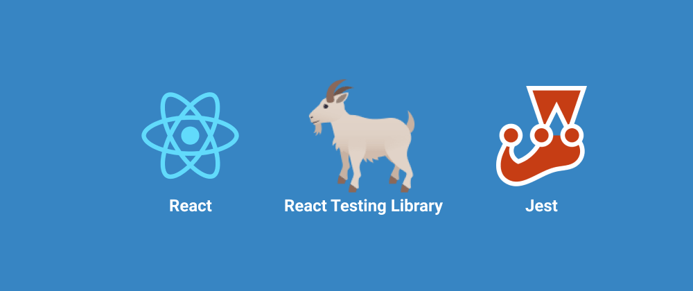

<link rel="stylesheet" href="style.css">

# RTL(React Testing Library) + Jest를 사용한 React Testing 연습 프로젝트

<section>
    <h2><b>Project Status</b></h2>

🗓️ 2021.03.07(Sun)

**(1) Issue1) Project initial setup**

→ [https://github.com/LeeHyungi0622/practice-test-with-react-test-library/issues/1](https://github.com/LeeHyungi0622/practice-test-with-react-test-library/issues/1)

**(1) Issue2) Jest를 사용하여 간단한 테스트 코드 작성해보기**

→ [https://github.com/LeeHyungi0622/practice-test-with-react-test-library/issues/2](https://github.com/LeeHyungi0622/practice-test-with-react-test-library/issues/2)

</section>
